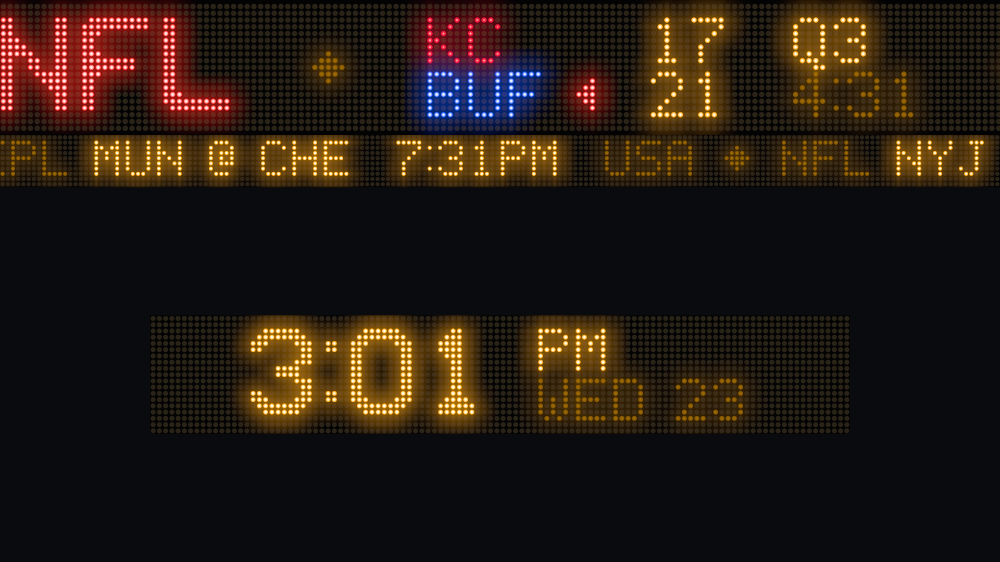

# Tickadee

Turn an old monitor and a cheap computer (old laptop, mini PC, Raspberry Pi 4/5)
into a dedicated LED-style ticker. Sports first, but built so any source
(weather, stocks, headlines) can feed it.



- **Top third:** a scrolling ticker that looks like a real LED sign: dot grid,
  glow, subtle flicker, and a flash when a score changes. A thinner crawl
  underneath shows upcoming games.
- **Bottom two thirds:** configurable widgets (game of the day, standings,
  fantasy matchup, clock, weather). Big plays trigger a full-screen *takeover*
  in team colors.
- **Appliance:** boots straight to the display; managed from a web page on
  your laptop or phone.

Written entirely in Rust. The display is a native GPU app (wgpu), not a web
page, so it runs smoothly on weak hardware with no browser. There is no npm or
JavaScript toolchain anywhere in the project.

> **Status: Phase 1.** The display runs on built-in mock data. No live data yet.

## Quick start

Requires a recent stable Rust (1.88+).

```sh
cargo run --release -p tickadee-display                  # 1920x1080 window
cargo run --release -p tickadee-display -- --size 1366x768 --led-color green
cargo run --release -p tickadee-display -- --fullscreen  # press F to toggle, Esc/Q to quit
cargo run --release -p tickadee-display -- --help        # all options
```

Render a single frame to a PNG (no window, handy for previews and for checking
other resolutions):

```sh
cargo run --release -p tickadee-display -- --screenshot out.png --size 1024x768 \
  --at 4.2 --scroll-to mock:nfl:1 --flash mock:nfl:1 --flash-age 0.05
```

The mock feed ticks game clocks every second and scores a random live game
every 6 to 11 seconds (the first at 4 seconds), which flashes that game on the
ticker.

## Development

```sh
cargo test --workspace                       # unit tests
cargo clippy --workspace --all-targets -- -D warnings
cargo fmt --all
cargo deny check                             # advisories, licenses, sources (cargo install cargo-deny)
```

CI runs all of the above on every push, plus an ARM64 Linux build to catch
Raspberry Pi issues early.

### Layout

```
crates/
  core/       No I/O. Normalized sports schema, ticker segments, LED font and
              rasterizer, alerts, layout math, config. Most tests live here.
    fonts/    led5x8.txt: the LED font as editable ASCII art.
  display/    Native wgpu + winit app: LED shader, scrolling, flashes, mock feed.
```

Planned crates: `server` (axum: providers, scheduler, WebSocket, admin),
`provider-espn`, `fantasy-sleeper`.

### How the LED effect works

1. Sources describe content as **segments** (runs of colored text, optionally
   stacked two lines high). They never touch pixels.
2. The **rasterizer** (`core::ticker`) draws segments into a bitmap with one
   texel per LED, using the hand-drawn 5x7 font or its Scale2x double-size
   version.
3. The **display** uploads that strip once. Each frame a shader gathers the
   visible window of LEDs (scrolling and flicker), blurs that tiny image for
   glow, and draws round dots per screen pixel. Scrolling only changes a
   number, so the CPU does almost nothing per frame.

Everything is limited to WebGL2 / OpenGL ES 3.0 features so it runs on a
Raspberry Pi 4.

### Editing the font

`crates/core/fonts/led5x8.txt` is plain text: `= A` starts a glyph, then up
to 8 rows of `#` (lit) and `.` (unlit). Digits must stay 5 wide so scores
don't jitter. Run `cargo test -p tickadee-core` after editing.

## Hardware (target)

| | Minimum | Recommended |
|---|---|---|
| CPU | 64-bit x86_64 or ARM64 | quad core, last ~10 years |
| GPU | OpenGL ES 3.0 or Vulkan (Mesa) | Vulkan |
| RAM | 1 GB | 2 GB+ |
| Storage | 16 GB | 32 GB+, A2 SD card or USB SSD |
| Network | Ethernet (WiFi optional) | Ethernet |
| OS | Ubuntu 24.04 LTS + Ubuntu Frame | |

Raspberry Pi 4 (2 GB+) and 5 work; Pi 3 / Zero 2 W do not (GLES 2 only).

## Roadmap / TODO

### Phase 1: repo + LED display on mock data ✅ (in review)
- [x] Cargo workspace, rustfmt, clippy (`-D warnings`), CI, cargo-deny
- [x] Normalized game schema (all five sports) + mock fixtures
- [x] Generic ticker segments, alerts, display config, layout math
- [x] Hand-drawn LED font + Scale2x large font
- [x] LED renderer: dot grid, glow, flicker, stepped or smooth scroll
- [x] Two-line game blocks, league headers, team colors made LED-safe
- [x] Score flash (invert blink, then fading boost)
- [x] Crawl with upcoming games; placeholder LED clock in the widget area
- [x] 1080p / 1366x768 / 4:3 layouts; headless `--screenshot`
- [ ] Verify 60 fps on a real Raspberry Pi 4 (the display logs fps every 10 s)

### Phase 2: live data
- [ ] `server` crate (axum + tokio), `DataProvider` trait
- [ ] ESPN provider: fetch + pure `normalize()` with saved JSON fixtures and tests
- [ ] Poll scheduler: 10 to 15 s live, 60 s pre-game, 15 to 30 min idle; jitter; backoff; stale-but-served cache
- [ ] WebSocket protocol (`core::protocol`); display client with reconnect; mock feed becomes a `--mock` flag
- [ ] Server formats games into segments so the display stays source-agnostic

### Phase 3: events + takeovers
- [ ] Event engine: diff snapshots into touchdown / FG / safety / HR / run / goal / final / score correction
- [ ] Deterministic alert ids (no repeats across restarts); no alerts on first snapshot or stale data
- [ ] Takeover renderer in the widget area (team colors, ~10 s)
- [ ] Tests for event detection per sport

### Phase 4: widgets + admin
- [ ] Widget trait + manifests with JSON-Schema settings (schemars)
- [ ] Widgets: game of the day (line score), scores list, standings, clock, weather
- [ ] Admin web UI (askama, plain HTML/CSS, no third-party JS); laptop-first, works on phones
- [ ] Layout: preset slots with drag-and-drop on desktop, dropdowns on phones
- [ ] SQLite settings store; time zone; night-time screen-off schedule; "data is stale" indicator

### Phase 5: fantasy
- [ ] Sleeper plugin: username / league lookup, matchup, starters with live points
- [ ] Player matching via Sleeper's `espn_id`; fantasy info in takeovers

### Phase 6: kiosk
- [ ] Ubuntu Frame + systemd units (server, display); mDNS `tickadee.local`
- [ ] First-boot screen: hostname, IP, QR code, one-time 6-digit setup code (loopback-only)
- [ ] Password creation on first login; setup code expires
- [ ] SSH off by default (toggle in admin, keys recommended); optional self-signed HTTPS
- [ ] Password reset via a file on the boot partition
- [ ] Optional: WiFi captive portal when there's no Ethernet
- [ ] Decide packaging: snaps on Ubuntu Core (auto-update, rollback) vs .deb

### Phase 7: distribution
- [ ] Flashable Raspberry Pi image; installer for x86 Ubuntu
- [ ] Automatic updates

### Later
- [ ] Non-sports sources: stocks, weather alerts, RSS, Home Assistant

## Contributing

Pull requests go to the `dev` branch; `main` holds stable releases. See
[CONTRIBUTING.md](CONTRIBUTING.md). Security issues: see [SECURITY.md](SECURITY.md).

## License

Proposed: MIT OR Apache-2.0 (to be confirmed before the first release).
