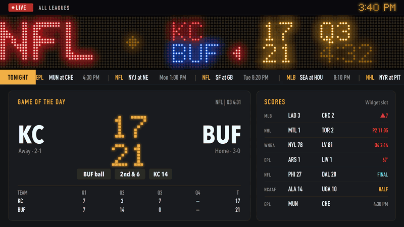
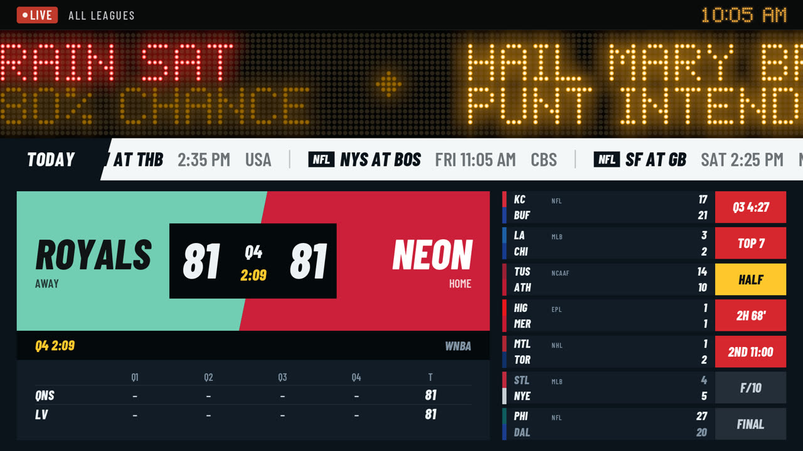
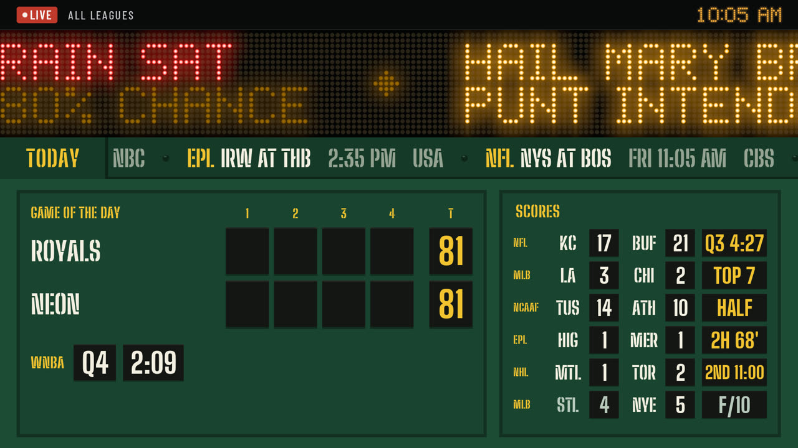
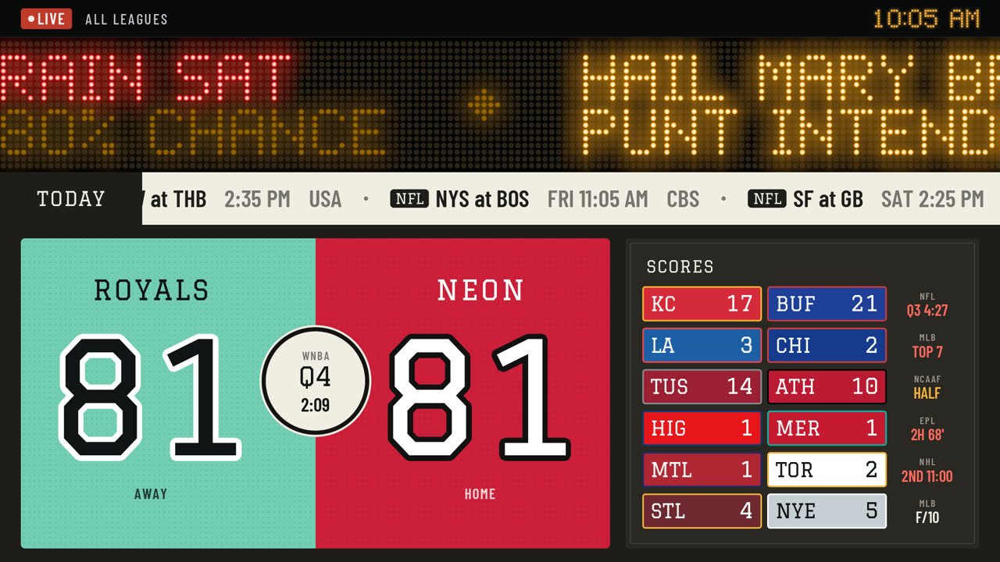

<p align="center">
  <picture>
    <source media="(prefers-color-scheme: dark)" srcset="media/marqueet-mark-paper.svg">
    
  </picture>
</p>

<h1 align="center">Marqueet</h1>

<p align="center">
  <strong>An old monitor + a cheap computer = a live LED sports ticker.</strong><br>
  Pure Rust. Native GPU rendering, no browser. Built to run on a Raspberry Pi 4.<br>
  Sports first; weather, stocks and anything else can plug in.
</p>

<p align="center">
  <a href="https://github.com/adamson34/marqueet/actions/workflows/ci.yml"></a>
  <a href="LICENSE"></a>
  
  
  
</p>

```sh
cargo run --release -p marqueet-server &      # live scores from ESPN
cargo run --release -p marqueet-display       # the LED ticker, fed by the server
```



> **Concept mockup.** This shows where Marqueet is headed, not what it does
> today. The LED ticker in it is the real renderer (including the score flash);
> the header, crawl styling, widget cards and touchdown takeover are design
> layers composited on top, showing the planned look for Phase 4
> ([ADR-0007](docs/adr/0007-led-ticker-flat-widgets.md)). Today the header,
> the crawl, the Game of the Day and Scores cards, and touchdown / home run / goal
> takeovers are real; standings, fantasy and weather are still to come.

## What you get

A big scrolling LED sign across the top of the screen (every letter made of
glowing dots), a crawl of tonight's games beneath it, and clean, readable
widget cards below: game of the day with a line score, a scores board,
standings, your fantasy matchup. When someone scores, their game flashes. When a big
play happens (touchdown, home run, goal), a full-screen *takeover* in team
colors interrupts the widgets for a few seconds, and it tells you when it's
*your* fantasy player.

It boots straight into the display, with no desktop, and you manage it from a
web page on your laptop or phone.

## Why this exists

Sports tickers are great in a bar and absent at home. The options today:

- **MagicMirror²**: a general dashboard, but it's Electron plus a pile of npm
  modules, runs a whole browser, and has no concept of "something just
  happened".
- **mlb-led-scoreboard / nfl-led-scoreboard**: lovely, but they need RGB LED
  matrix panels, a HAT and soldering, and each covers a single league.
- **Tidbyt**: the hardware is no longer sold.
- **DAKboard and similar**: subscriptions, cloud accounts, not real-time.

Marqueet reuses hardware you already have (a spare monitor and a Pi 4, mini
PC or old laptop), draws a convincing LED sign on it with the GPU, and covers
every league in one place. It's a single Rust binary per component with no
JavaScript anywhere: no npm, no bundler, no `node_modules` to keep patched.

## What the ticker shows

| Sport | Live game block |
|---|---|
| Football | Teams, score, quarter and clock, possession `◀` (red inside the red zone) |
| Baseball | Teams, score, `▲`/`▼` inning, outs |
| Basketball | Teams, score, quarter and clock |
| Hockey | Teams, score, period and clock, `PP` on the power play |
| Soccer | Teams, score, half and minute |
| College | AP rank before the team |

Scheduled games show the local start time (plus the weekday when it isn't
today) and the network. Finals show `FINAL` or `F/OT`, with the losing team
dimmed. Team colors are adjusted so navy and near-black teams still glow
(a navy primary becomes a brighter blue, not the red secondary). Games are grouped
under league headers: live first, then finals, then upcoming.

If the National Weather Service issues a warning for your location (US), it
leads the ticker in red and takes over the screen when it's issued.

Follow your Sleeper fantasy teams and the matchup rides on the ticker, flashing
when you take the lead; a Fantasy widget shows every starter's points.

Your favorite teams' standings ride along on each league's header
(`NFL  BUF 1ST / AFC EAST 3-0`).

With a location set, each loop of the ticker opens with the weather: an LED
icon, the temperature, today's high and low, and a heads-up when rain or snow
is on the way.

Your own scripts can add to the ticker too, in any language: stock prices, a
build status, the doorbell. Create a feed on the admin page and `POST` some
JSON; see [docs/FEEDS.md](docs/FEEDS.md).

The crawl lists what's up next in flat text behind a TONIGHT (or TODAY, or UP
NEXT) tag. Below it, the widget area: one to three slots (pick a layout on the
admin page), each showing the Game of the Day (a favorite's live
game, else the closest live game) with a line score, a Scores card for
everything else, Standings (your favorite's division or table, highlighted),
or Weather (current conditions and five days, from
[Open-Meteo](https://open-meteo.com), CC BY 4.0).

Pick a **look** for the crawl and widgets on the admin page: **Broadcast** (like
TV score graphics, in the teams' colors), **Ballpark** (a painted scoreboard
with number plates) or **Varsity** (scores like jersey numbers). Change any of
its colors to make your own, and share it as a short code.

| Broadcast | Ballpark | Varsity |
|---|---|---|
|  |  |  |

<sub>Screenshots use the built-in demo data; the teams are made up.</sub>

Marqueet ships no team logos. You can turn on **logos from ESPN** (the scores
service) on the admin page, off by default, or add your own (one at a time or
as a team pack file); either way they show on the ticker and in the widgets.
See [docs/TEAM_PACKS.md](docs/TEAM_PACKS.md).

## Install

### From source

```sh
git clone https://github.com/adamson34/marqueet.git
cd marqueet
cargo run --release -p marqueet-server     # terminal 1: live scores
cargo run --release -p marqueet-display    # terminal 2: the display
```

`main` holds releases; `dev` (the default branch) has the latest work.

No server handy? `cargo run --release -p marqueet-display -- --mock` runs the
display on built-in demo data.

Requires Rust 1.88+. On Linux the display needs a GPU with OpenGL ES 3.0 or
Vulkan (Mesa drivers are fine).

### Get started: Raspberry Pi (easiest)

You need a Raspberry Pi 4 or 5 with its power supply, a microSD card (16 GB or
more), a TV or monitor, and either a network cable to your router or your
WiFi name and password.

1. Download **`marqueet-pi.img.xz`** from the
   [latest release](https://github.com/adamson34/marqueet/releases/latest).
2. Put it on the SD card with [Raspberry Pi Imager](https://www.raspberrypi.com/software/):
   *Choose OS → Use custom* → the file you downloaded, then your SD card, then
   *Next*. No network cable where the TV is? When it offers OS
   customisation, choose *Edit settings* and fill in your WiFi name and
   password; otherwise choose *No*.
3. Put the card in the Pi and plug in the TV (and the network cable, if
   you're using one) and power.
   The first start takes about 10 minutes while it installs; the screen says
   what it's doing (and tells you if it can't reach the internet).
4. Scan the QR code on the screen with your phone, type the 6-digit code, and
   pick a password. A few quick steps follow on your phone: your sports, your
   teams, your town, and (if you play) your Sleeper fantasy league.

Updates install by themselves. Forgot your password? Put the SD card in any
computer, create an empty file named `reset-password` on it, and start the Pi
again: the setup code comes back.

### Get started: any computer with Ubuntu (one command)

On a mini PC or an old laptop, install **Ubuntu 24.04**, plug it into your
network (a cable is easiest), and run:

```sh
curl -fsSL https://raw.githubusercontent.com/adamson34/marqueet/main/install.sh | sudo sh
```

That's it. The screen fills with the ticker and shows a QR code: scan it with
your phone (or open `marqueet.local:7878` on any device on your network),
type the 6-digit code from the screen, and pick a password. Then choose your
leagues, favorite teams and fantasy league from your phone.

- Run the same command again to update.
- Forgot your password? `sudo snap set marqueet reset-password=true`, and the
  setup code comes back on the screen.
- On a computer that normally starts a desktop, the installer asks before
  switching it to start straight into the ticker (and tells you how to undo
  it).

Under the hood: Marqueet ships as a snap running under
[Ubuntu Frame](https://ubuntu.com/frame) ([why](docs/adr/0011-packaging-snap.md)).
The installer takes it from the Snap Store's `stable` channel (store-signed;
snapd keeps it updated) and connects it to Frame. Want the latest `dev` build
to test? Set `MARQUEET_CHANNEL=edge` (the rolling
[`edge` pre-release](https://github.com/adamson34/marqueet/releases/tag/edge)). Building from source on a
classic distro instead? `packaging/systemd/` has units for the server and
display.

### Device images

Coming in Phase 7: a flashable Raspberry Pi image and an installer for Ubuntu
on x86, booting straight into the display.

## Usage

```sh
# Windowed preview at a common monitor size:
marqueet-display --size 1366x768

# Full screen (F toggles, Esc or Q quits):
marqueet-display --fullscreen

# Tune the look:
marqueet-display --led-color green --speed 30 --glow 0.8 --flicker 0.4
marqueet-display --led-color "#ff3355" --ticker-rows 17 --smooth

# Hide the crawl and give the ticker a quarter of the screen:
marqueet-display --crawl-share 0 --ticker-ratio 0.25
```

Everything also renders headless, which is handy for previews, docs and bug
reports:

```sh
# One frame to a PNG, 6 simulated seconds in, with a game mid-flash:
marqueet-display --mock --screenshot out.png --size 1024x768 \
  --scroll-to mock:nfl:1 --flash mock:nfl:1

# Script a score as if a live alert arrived (updates the game, flashes it,
# and, for a touchdown / home run / goal, shows the takeover):
marqueet-display --mock --screenshot td.png --score mock:nfl:1:home:7 --score-at 5 --at 6.5 \
  --scroll-to mock:nfl:1

# A frame sequence, then a GIF:
marqueet-display --mock --record frames/ --size 1280x720 --at 0 --duration 8 --fps 12 --flicker 0
ffmpeg -framerate 12 -i frames/frame_%05d.png \
  -vf "scale=720:-1:flags=lanczos,split[a][b];[a]palettegen=max_colors=64:stats_mode=diff[p];[b][p]paletteuse=dither=none" \
  ticker.gif
```

### Live scores (server)

```sh
# Poll ESPN and serve the display feed on 127.0.0.1:7878:
cargo run --release -p marqueet-server
cargo run --release -p marqueet-server -- --leagues nfl,mlb,nhl,epl
cargo run --release -p marqueet-server -- --list-leagues

# What the server knows, including per-league fetch health:
curl -s localhost:7878/api/games | jq '.status, [.leagues[] | {id, games: (.games | length), failures, stale}]'

# Recent scoring alerts (touchdowns, home runs, goals, finals):
curl -s localhost:7878/api/alerts | jq '.[] | {title, detail, level}'
```

Settings live in a SQLite file (`--db`, default `marqueet.db`) and apply
immediately: leagues, favorite teams, which big plays take over (all,
favorites only, or none), the widget slots, the look and colors, the LED look, the time zone, and
overnight quiet hours. Change them on the admin page at <http://localhost:7878/admin> on the
device. To use it from your laptop, listen on the network:

```sh
marqueet-server --listen 0.0.0.0:7878
```

On first start there's no admin password yet, so the screen (and the server's
log) shows a one-time 6-digit code and the address to open, e.g.
`http://marqueet.local:7878/setup`. Enter the code there and choose a password;
you're logged in, and the code stops working. Until then other devices only
see that setup page. Forgot the password? Start the server with
`--reset-file /boot/firmware/marqueet-reset-password` and create that file.
For headless installs, `MARQUEET_ADMIN_PASSWORD` sets the password instead.

The page is plain
HTML and CSS with one small hand-written script (drag to reorder leagues); it
still works with JavaScript off. Settings are also available as JSON:

```sh
curl -s localhost:7878/api/settings > settings.json   # edit, then:
curl -s -X PUT -H 'Content-Type: application/json' --data @settings.json localhost:7878/api/settings
```

The server polls politely: about every 12 s only while games are live,
slower otherwise, with backoff when ESPN errors. If ESPN fails, the last good
scores stay on screen and the league is marked DELAYED.

The display connects to `ws://127.0.0.1:7878/ws` by default (`--server URL`
to change it), shows CONNECTING TO SERVER until the first scores arrive, keeps
the last scores up if the server goes away, and reconnects on its own.

`marqueet-display --help` lists every option. With `--mock` the display runs
on built-in demo data instead: game clocks tick, and a random live game scores
every 6 to 11 seconds. The headless examples above use live data unless you
add `--mock`; `--score` only works with `--mock`.

## Hardware

| | Minimum | Recommended |
|---|---|---|
| CPU | 64-bit x86_64 or ARM64 | Quad core from the last ~10 years |
| GPU | OpenGL ES 3.0 or Vulkan (Mesa) | Vulkan |
| RAM | 1 GB | 2 GB+ |
| Storage | 16 GB | 32 GB+, A2 SD card or USB SSD |
| Network | Ethernet (WiFi optional) | Ethernet |
| OS | Ubuntu 24.04 LTS + Ubuntu Frame | |

Raspberry Pi 4 (2 GB+) and Pi 5 are the targets; Pi 3 and Zero 2 W are not
supported (OpenGL ES 2.0 only). Intel N100-class mini PCs and most laptops
from about 2012 onward work.

## Scope

**In scope:**

- A full-screen LED-style ticker and crawl, with flashes and takeovers
- Live scores for major leagues through pluggable data providers (ESPN first)
- Fantasy matchups through pluggable fantasy providers (Sleeper first)
- Configurable widgets: game of the day, scores, standings, fantasy, clock, weather
- A local admin page (laptop-first, works on phones), password protected
- An appliance experience: boot to display, first-boot setup code, mDNS `marqueet.local`

**Not in scope:**

- A browser-based display, or any JavaScript toolchain
- Physical RGB LED matrix panels (see mlb-led-scoreboard for that)
- Cloud accounts, telemetry, or anything leaving your network besides data-provider requests
- Betting features
- A general-purpose dashboard framework: new sources plug into the ticker and alerts, not arbitrary layouts

## What's next

Phases 1 (the LED display), 2 (live scores) and 3 (scoring alerts and
takeovers) are done. The full plan, with
checklists, lives in [`docs/ROADMAP.md`](docs/ROADMAP.md).

- [x] **Phase 1:** repo, CI, schema, LED renderer, flashes, crawl, welcome logo
- [x] **Phase 2:** server + ESPN provider, caching and polling, WebSocket feed to the display
- [x] **Phase 3:** event engine (touchdowns, home runs, goals) and takeover animations
- [ ] **Phase 4:** widget system and admin page
- [ ] **Phase 5:** Sleeper fantasy
- [ ] **Phase 6:** kiosk: Ubuntu Frame, systemd, mDNS, first-boot flow
- [ ] **Phase 7:** flashable image and installer

## Caveats

ESPN's scoreboard endpoints are **unofficial and undocumented**. They can
change or disappear without notice. Marqueet is built to degrade gracefully
(serve the last good data, mark it stale, back off), and providers are
plugins so another source can replace ESPN, but a broken upstream means
stale scores until an update ships. Marqueet is not affiliated with ESPN,
any league, or any team; team names and colors are used only to show scores.

Performance on a real Raspberry Pi 4 hasn't been measured yet. The display
logs its frame rate every 10 seconds so it's easy to check.

## Brand

**Marqueet** = *marquee* (the lit sign) + *parakeet*. The logo is a parakeet
drawn on an LED dot grid. It lives as editable text in
[`crates/core/assets/mark.txt`](crates/core/assets/mark.txt) (plus a head-only
[`favicon.txt`](crates/core/assets/favicon.txt)), and everything is generated
from it: the SVGs in [`media/`](media/) and the welcome screen on the device.
After editing, run `MARQUEET_BLESS=1 cargo test -p marqueet-core logo` to
regenerate the SVGs; CI fails if they drift.

| File | Use |
|---|---|
| `marqueet-mark.svg` | LED amber, for dark backgrounds |
| `marqueet-mark-ink.svg` / `-paper.svg` | Monochrome for light / dark backgrounds |
| `marqueet-favicon*.svg` | Head only, legible at 16 px (the `currentColor` variant follows the page) |

## Project layout

- [CLAUDE.md](CLAUDE.md): architecture, conventions, and the project's design contract.
- [docs/ROADMAP.md](docs/ROADMAP.md): the phased plan with checklists.
- [docs/adr/](docs/adr/): Architecture Decision Records.
- [CONTRIBUTING.md](CONTRIBUTING.md): branches (`dev` is the default; PRs go there), checks, principles.
- [docs/PI-DEVELOPMENT.md](docs/PI-DEVELOPMENT.md): reaching a Pi over SSH for development (the image's developer switch).
- [SECURITY.md](SECURITY.md): private vulnerability reporting.
- [CHANGELOG.md](CHANGELOG.md): notable changes.

```
crates/
  core/       No I/O. Sports schema, ticker segments, LED font and rasterizer,
              alerts, layout math, config, logo. Most tests live here.
    assets/   mark.txt, favicon.txt: the logo as dot grids.
    fonts/    led5x8.txt: the LED font as ASCII art.
  server/     marqueet-server: adaptive polling, cache, WebSocket feed, JSON API.
  provider-espn/  ESPN scoreboard provider: fetch + pure normalize, tested
              against saved real responses.
  display/    Native wgpu + winit app: LED shader, scrolling, flashes,
              welcome screen, mock feed, headless capture.
media/        Generated logo SVGs and the concept mockup GIF.
```

## Not affiliated

Marqueet is an independent open-source project. It is not affiliated with,
sponsored by or endorsed by ESPN, any league, team or player, or any other
data provider. Team and player names come from live data and are shown only
to identify games and scores. Marqueet ships no team logos, and the teams and
players in its demo data are made up.

## License

[MIT](LICENSE). The bundled fonts are under the SIL Open Font License 1.1:
[Barlow Condensed](https://github.com/jpt/barlow) © The Barlow Project Authors,
[Big Shoulders](https://github.com/xotypeco/big_shoulders) © The Big Shoulders Project Authors,
and [Graduate](https://github.com/etunni/graduate) © The Graduate Project Authors. Each
license is next to its font in [`crates/display/assets/fonts/`](crates/display/assets/fonts/).
